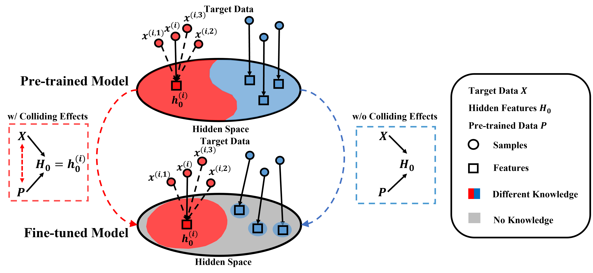
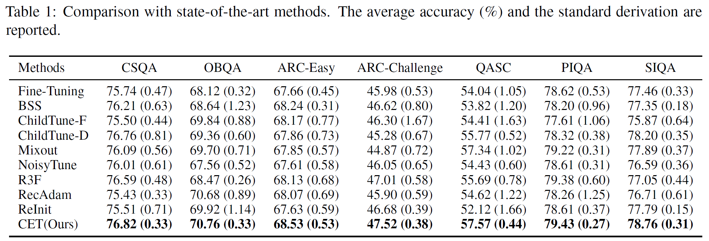

# Preserving Commonsense Knowledge from Pre-trained Language Models via Causal Inference (ACL2023)

This repo provides the source code for our method

- [CET](https://aclanthology.org/2023.acl-long.509/) : a fine-tuning method for preserving commonsense knowledge from Pre-trained LMs

Besides, we also provide re-implementation of the following methods for a fair comparison:

- Vanilla fine-tuning: fine-tuning has been proven to be a simple and effective method of adapting large PLMs to downstream tasks. 
- [BSS](https://github.com/thuml/Batch-Spectral-Shrinkage): BSS focuses on mitigating negative transfer by penalizing the small singular values of the feature matrix. 
- [ChildTune-F&ChildTune-D](https://github.com/alibaba/AliceMind/tree/main/ChildTuning): ChildTune-F\&ChildTune-D update a subset of parameters (called child network) of large PLMs in the backward process. ChildTune-D utilizes the Fisher Information Matrix estimated by the pre-trained model to determine the child network. ChildTune-F uses Bernoulli distribution to determine the child network. 
- [Mixout](https://github.com/bloodwass/mixout): Mixout randomly mixes the parameters of the pre-trained and the fine-tuned model to regularize the fine-tuning process. 
- [NoisyTune](https://aclanthology.org/2022.acl-short.76/): NoisyTune adds uniform noises to the parameter of the pre-trained model based on their standard deviations. 
- [R3F](https://github.com/facebookresearch/fairseq/tree/main/examples/rxf): R3F alleviates representational collapse by introducing parametric noise. R3F generates noise from either a normal or uniform distribution.
- [RecAdam](https://github.com/Sanyuan-Chen/RecAdam): RecAdam optimizes a multi-task objective and utilize an annealing coefficient to gradually shift the objective from pre-training to downstream tasks. 
- [ReInit](https://openreview.net/forum?id=OQ08SN70M1V): Zhang et. al. verified that transferring the top pre-trained layers slows down learning and hurts performance. ReInit re-initializes the top layers of PLMs when adapting to new tasks.



- ## Overview of the directory
- *config/* : the directory of configurations for each models
- *modeling/* : modeling the pre-trained models
- *utils/* : implementing different fine-tuning methods
- *main.py* : the python file to be executed

```
./
├── config
│   ├── arc_challenge
│   ├── arc_easy
│   ├── csqa
│   ├── siqa
│   ├── obqa
│   ├── piqa
│   ├── qasc
│   └── default.yaml
├── main.py
├── modeling
│   └── bert_models.py
└── utils
    ├── data_utils.py
    ├── layers.py
    ├── logger_utils.py
    ├── mixout_utils.py
    ├── optimization_utils.py
    ├── other_utils.py
    ├── parser_utils.py
    ├── split_data_uils.py
    └── tokenization_utils.py
```

## Step 0: Prepare your environments
Reference environment settings:
```
python             3.9.13
torch              1.13.1+cu117
transformers       4.30.2
```

## Step 1: Setting your paths and Prepare your data
You can specify the path for storing datasets and saving logs in *./utils/parser_utils.py*.

For example, the default paths for loading the *OBQA* dataset are *./data/obqa/official/train.jsonl*, *./data/obqa/official/dev.jsonl*, and *./data/obqa/official/test.jsonl*.

The *.jsonl* files have the format as follows:
```
{"id": "7-980", "question": {"stem": "The sun is responsible for", "choices": [{"text": "puppies learning new tricks", "label": "A"}, {"text": "children growing up and getting old", "label": "B"}, {"text": "flowers wilting in a vase", "label": "C"}, {"text": "plants sprouting, blooming and wilting", "label": "D"}]}, "answerKey": "D"}
{"id": "7-584", "question": {"stem": "When standing miles away from Mount Rushmore", "choices": [{"text": "the mountains seem very close", "label": "A"}, {"text": "the mountains are boring", "label": "B"}, {"text": "the mountains look the same as from up close", "label": "C"}, {"text": "the mountains seem smaller than in photographs", "label": "D"}]}, "answerKey": "D"}
{"id": "7-870", "question": {"stem": "When food is reduced in the stomach", "choices": [{"text": "the mind needs time to digest", "label": "A"}, {"text": "take a second to digest what I said", "label": "B"}, {"text": "nutrients are being deconstructed", "label": "C"}, {"text": "reader's digest is a body of works", "label": "D"}]}, "answerKey": "C"}
{"id": "7-321", "question": {"stem": "Stars are", "choices": [{"text": "warm lights that float", "label": "A"}, {"text": "made out of nitrate", "label": "B"}, {"text": "great balls of gas burning billions of miles away", "label": "C"}, {"text": "lights in the sky", "label": "D"}]}, "answerKey": "C"}
...
```

You can download the data we used in this [link](https://drive.google.com/file/d/1uE3_xbYX2FJbbw4zAGE7whbgKNRzcyHL/view?usp=drive_link), 
or you can use your own datasets with the same format as above.

## Step 2: Run main.py
Specify your configurations (e.g., *./config/obqa/roberta_large_baseline.yaml*) and run the following command 
```
python3 main.py --config {selected_yaml_configuration_path} --run_id {your_experiment_id}
```
Then, the results as well as the model checkpoint will be saved automatically in the directory *./save_models/* (in default).

### Experimental results




If you find the code useful, please consider citing this work
```
Junhao Zheng, Qianli Ma, Shengjie Qiu, Yue Wu, Peitian Ma, Junlong Liu, Huawen Feng, Xichen Shang, and Haibin Chen. 2023. Preserving Commonsense Knowledge from Pre-trained Language Models via Causal Inference. In Proceedings of the 61st Annual Meeting of the Association for Computational Linguistics (Volume 1: Long Papers), pages 9155–9173, Toronto, Canada. Association for Computational Linguistics.
```
